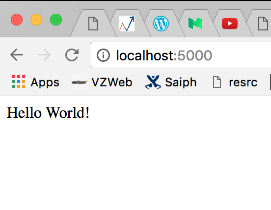

# [Heroku: Cloud Application Platform](https://www.heroku.com)

- Walk throguh how to create a python Flask web app
  and deploy the Flask app to Heroku cloud platform


## Create a project root folder \`test_heroku\`
```
>> mkdir test_heroku
```

## Install python dependency packages, e.g. flask
```
>> virtualenv test_heroku
# bin, lib, include, pip-selfcheck.json are generated.

>> cd test_heroku
>> ./bin/pip install flask
# use the `pip` under the `./bin/` folder!
```

## Create \`app.py\` under \`test_heroku\`
```
import os
from flask import Flask

app = Flask(__name__)

@app.route('/')
def hello():
    return 'Hello World!'

if __name__ == '__main__':
    # Bind to PORT if defined, otherwise default to 5000.
    port = int(os.environ.get('PORT', 5000))
    app.run(host='0.0.0.0', port=port)
```

## Run \`app.py\` and nevigate to \`localhost:5000\` in the web browser
```
>> ./lib/python app.py
```


## Create two files required for Heroku to deploy the Flask web app
### 1. Create the \`requirements.txt\` file
```
>> ./lib/pip freeze > requirements.txt
# use the `pip` under the `./bin/` folder!

>> cat requirements.txt
Flask==0.9
Jinja2==2.6
Werkzeug==0.8.3
wsgiref==0.1.2
```

### 2. Create the \`Procfile\` file
```
web: python app.py
```

## Create a local GIT repo
```
>> git init
>> git add app.py requirements.txt Procfile
>> git commit -m "init commit"
```

## Deploy to the Heroku remote host
```
>> heroku create
# login credential is required at the first time

>> heroku apps:rename iloveheroku
# rename a randomly-generated app name to iloveheroku

>> git push heroku master
# push the local git commit to heroku remote repo
```

## Test the \`iloveheroku\` web app up running
```
Nevigate to http://iloveheroku.herokuapp.com in the web browser
```

## To deploy any code change afterwards
```
>> git commit -m "code change"
>> git push heroku master
```

## All things config
```
>> heroku ps:scale web=1
# Configure the Heroku web server to use one dyno/instance

>> heroku ps
# check the status of the dyno/instance

>> heroku logs
# check web logs
```


# References:
* https://www.heroku.com
* https://devcenter.heroku.com/articles/getting-started-with-python
* https://github.com/heroku/python-sample
* http://virantha.com/2013/11/14/starting-a-simple-flask-app-with-heroku/


